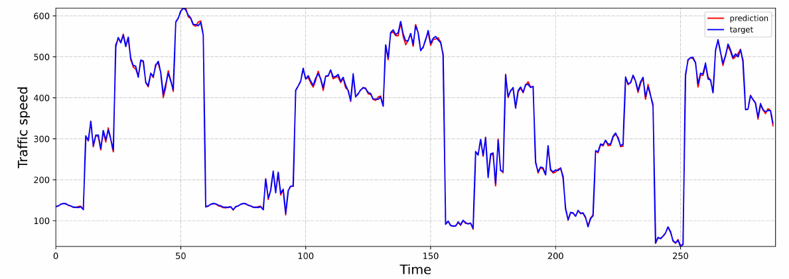

# STCGAT: Spatial-temporal causal networks for complex urban road traffic flow prediction

The code and data of our proposed Spatial-temporal Causal Graph Attention Network model are shown here, and you can find our article at [arXiv](https://arxiv.org/abs/2203.10749). If you have any questions about our work, you are welcome to talk to us anytime communication.

## 1. Experimental operation

### 1.1 Environment Configuration

First you need to do the installation of dependent libraries such as pytorch.

```
pip install -r requirements.txt
```

### 1.2 Dataset Preparation

You can download the required PEMSD4 and PEMSD8 datasets via this linkhttps://github.com/zhangshqii/STCGAT/releases. Once the dataset is downloaded, it is placed under the specified folder.

### 1.3 Training and testing models

Set the Model and dataset name in the train.py file, and click Run to run it. It is worth noting that Model intelligently selects Train or Test, Train is the training mode and Test is the testing mode, in Test mode, there needs to be a trained model that can be loaded.

The training is performed on the PEMD4 dataset as follows.

```python
Mode = 'Train'  # Train or Test
DATASET = 'PEMSD4'
MODEL = 'STCGAT'
```

## 2. The Model Architecture

We will present how the proposed STCGAT model implements the road traffic prediction task. As shown in Figure 1, STCGAT consists of three main components: 1) GAT layer: the traffic network is modeled to capture the spatial correlation between road nodes; 2) CTCN layer: the causal temporal convolutional network is mainly composed of a combination of Bi-directional Long-short Term Memory(BiLSTM)  Prediction layer: Prediction results are output using a fully connected neural network. Next, we will first introduce modeling the traffic network space with GAT and capturing spatial dependencies and then discuss the use of causal, temporal convolutional layers to capture temporal correlations. After submitting these components, we will briefly summarize the entire framework.


<center>Fig.1   Spatial-temporal Causal Graph Attention Network framework.</center>

We conducted extensive comparison experiments with other traffic prediction methods on two real traffic datasets to evaluate the model's prediction performance. Compared with the best experimental results of different prediction methods, the prediction performance of our approach is improved by more than $50\% $​.  As shown in Table 1.

<center>Table.1   Experimental results.</center>


## 3. Experimental description

To evaluate the prediction performance of STCGAT, we conducted extensive experiments on two real public traffic datasets, PEMS04 and PEMS08. These two datasets are from Caltrans' Performance Measurement System (PeMS), aggregating the collected traffic information every 5 minutes. Meanwhile, the spatial network of each dataset is constructed based on a real road network, containing information such as the distance of road nodes. Table 2 summarizes some critical statistics for these two datasets.

<center>Table.2   Dataset Statistics.</center>


STCGAT is written in Pytorch 1.10.0, using the same hyperparameters in both datasets. In GAT, the number of hidden layers was set to 6 using the 4-head attention mechanism. The size of the BiLLSTM hidden layers was set to 64. the size of the TCN kernel was set to 2. a total of 9 hidden layers were set to 64 for the residual module. The initial value of the expansion factor was set to 2. the batch size was set to 64, the learning rate size was 0.001, and the model was optimized using the Adam optimizer with a maximum number of iterations of 500. All experiments were performed on a server with NVIDIA GeForce RTX 2080Ti graphics cards.

The prediction results are shown in Figure 2 and Figure 3


<center>Fig.2   Visualization on the PEMSD4.</center>



<center>Fig.3   Visualization on the PEMSD8.</center>
